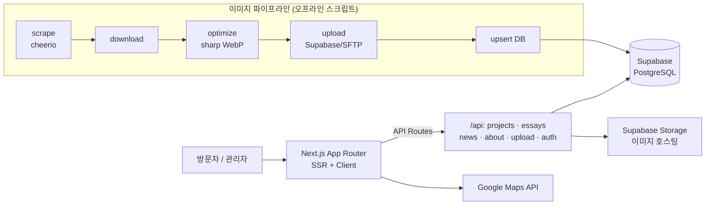

<!--
  Tedoori_web_v2 README 초안 — 이 내용을 레포 루트의 README.md 로 교체하세요.
  [ ] 표시는 확인/교체 필요. 스크린샷 경로(docs/…)는 실제 이미지 추가 후 연결.
-->
<div align="center">

# 🏛️ Tedoori Web

**건축사사무소 '테두리(Tedoori Architects)'의 공식 포트폴리오 웹사이트**

프로젝트 갤러리 · 블로그 · 관리자 CMS를 갖춘 풀스택 웹 애플리케이션


**[🔗 라이브 사이트 tedoori.net](https://tedoori.net)**

</div>

---

## 📌 프로젝트 소개

- **무엇:** 실제 건축사사무소가 운영하는 프로젝트 포트폴리오 + 블로그 웹사이트 ([tedoori.net](https://tedoori.net) 배포·운영 중)
- **왜:** 건축가가 개발자 없이도 직접 프로젝트/글/이미지를 올리고 정렬할 수 있는 **관리자 CMS**가 필요했음
- **특징:** 별도 백오피스 없이, 같은 사이트에서 **관리자 모드 토글** 하나로 콘텐츠를 실시간 편집 (드래그 정렬 · WYSIWYG 에디터 · 이미지 업로드)
- **내 역할:** [ 프론트엔드·백엔드 풀스택 개발, Supabase 스키마 설계, 이미지 파이프라인 구축 ]

<!-- 스크린샷 1~2장 추가 시 임팩트 큼. 예: docs/home.png, docs/admin.png -->
<!--  -->

## ✨ 주요 기능

| 기능 | 설명 |
|---|---|
| 🖼️ 프로젝트 갤러리 | 건축 프로젝트를 카드 그리드로 전시, 상세 페이지 제공 |
| 🔀 드래그 앤 드롭 정렬 | 관리자가 `@dnd-kit`으로 프로젝트 순서를 직접 재배치 |
| ✍️ WYSIWYG 블로그 에디터 | `TipTap` 기반 리치 에디터로 상세 페이지 본문 작성 (이미지·링크·정렬·하이라이트) |
| 🔐 관리자 모드 | 사용자/관리자 뷰 토글, 인증 후 콘텐츠 CRUD |
| 👁️ 공개 범위 제어 | 프로젝트별 public / team / private 노출 설정 |
| 🎬 다양한 콘텐츠 타입 | 일반 프로젝트 · YouTube 영상 · 메모 카드 지원 |
| 🗺️ 오시는 길 | Google Maps 연동 사무소 위치 안내 |
| ↩️ Undo/Redo | 프로젝트 변경 이력 추적 |
| 🖼️ 이미지 파이프라인 | 수집 → WebP 최적화(3사이즈) → 스토리지 업로드 → DB 반영 자동화 |
| 💾 백업 시스템 | Supabase DB·Storage 백업 스크립트 |

## 🏗️ 시스템 아키텍처



## 🧰 기술 스택

| 구분 | 기술 |
|---|---|
| Framework | Next.js 16 (App Router) · React 19 |
| Language | TypeScript 5 |
| Backend / DB | Supabase (PostgreSQL + Storage) · Next.js API Routes |
| 에디터 | TipTap 3 (WYSIWYG) |
| UI / UX | CSS Modules · @dnd-kit (드래그 정렬) · Radix UI · lucide-react |
| 이미지 처리 | sharp (WebP·리사이즈) · browser-image-compression |
| 데이터 수집 | cheerio · robots-parser · p-limit |
| 지도 | @react-google-maps/api |
| 인프라 | Vercel (배포) · SFTP/S3 (@aws-sdk) 업로드 · ssh2-sftp-client |
| 폰트 | Noto Sans/Serif KR |

## 🚀 실행 방법

```bash
# 1. 클론
git clone https://github.com/LeeHome2/Tedoori_web_v2.git
cd Tedoori_web_v2

# 2. 의존성 설치 (Node 18+)
npm install

# 3. 환경변수 설정 (.env.local.example 참고)
cp .env.local.example .env.local
#   NEXT_PUBLIC_SUPABASE_URL / NEXT_PUBLIC_SUPABASE_ANON_KEY / SUPABASE_SERVICE_ROLE_KEY

# 4. 개발 서버
npm run dev        # http://localhost:3000
```

Supabase 초기 설정은 [`SUPABASE_SETUP.md`](SUPABASE_SETUP.md), 이미지 수집·최적화 절차는 [`IMAGE_PIPELINE.md`](IMAGE_PIPELINE.md) 참고.

## 📁 폴더 구조

```
Tedoori_web_v2/
├── src/
│   ├── app/            # App Router — 페이지 + API Routes(projects/essays/news/about/upload/auth)
│   ├── components/     # Header · ProjectGrid · ProjectDetail · BlogEditor(TipTap) ...
│   ├── context/        # ProjectContext · AdminContext (상태 + CRUD)
│   ├── lib/            # supabase 클라이언트, db 쿼리 헬퍼
│   ├── data/           # 프로젝트 타입/인터페이스
│   └── types/          # DB 타입 정의
├── scripts/tedoori/    # 이미지 파이프라인 (scrape·download·optimize·upload·upsert)
├── supabase-schema.sql # DB 스키마 + RLS 정책 + Storage 버킷
├── backup-*.js         # DB/Storage 백업 스크립트
└── docs/
```

## 🗄️ 데이터베이스

- **projects** 테이블 + Supabase Storage 이미지 버킷
- **RLS(Row Level Security)** 정책으로 공개/팀/비공개 접근 제어 — 인증 사용자만 insert/update/delete
- Storage 정책: 공개 읽기 + 인증 사용자 업로드/수정/삭제

## 🔧 배포

Vercel에 GitHub 저장소를 연결하고 환경변수 3개를 설정하면 자동 배포됩니다. 자세한 절차는 위 실행 방법과 동일한 환경변수를 Vercel Dashboard → Settings → Environment Variables에 등록.

## 👤 역할

[ 개인 프로젝트 (풀스택) ]
